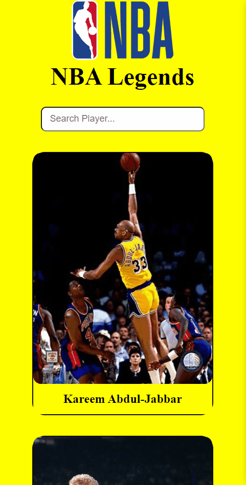

# Countries App
## Live Link: https://nba-legends-app-fay.netlify.app/
## Description
Welcome to the NBA Player Information App! This project provides a platform to showcase and explore legend NBA players' information. With an intuitive user interface. Users can learn about their favorite players, view and discover their stats.

## Features
- <span style="font-size: larger;">**Player Information**</span>: Access comprehensive information about each NBA player, including their career stats, achievements, and personal details.
- <span style="font-size: larger;">**Responsive Design**</span>: Enjoy a responsive design that ensures a seamless experience across different devices, such as desktops, tablets, and smartphones.
- <span style="font-size: larger;">**Search Functionality**</span>: Easily search for specific NBA players using the search bar for quick access.

## Project Skeleton
```
.
├── LICENSE
├── README.md
├── nba.gif
├── nba1.gif
├── package-lock.json
├── package.json
├── public
│   ├── favicon.ico
│   └── index.html
└── src
    ├── App.css
    ├── App.js
    ├── assets
    │   └── nba-logo.png
    ├── components
    │   ├── CardContainer.css
    │   ├── CardContainer.jsx
    │   ├── Header.css
    │   ├── Header.jsx
    │   ├── PlayerCard.css
    │   └── PlayerCard.jsx
    ├── helper
    │   └── data.js
    └── index.js
```
## Expected Outcomes
<div >


</div>

## Technologies and Libraries
- <span style="font-size: larger;">**React.js**</span>: A powerful JavaScript library for building interactive user interfaces.
- <span style="font-size: larger;">**React Hooks**</span>: React Hooks provide a way to use state and other React features in functional components without writing a class.
- <span style="font-size: larger;">**Font Awesome**</span>: Provides a wide range of icons used for visual elements and UI enhancement.

## Getting Started

To run the application on your local machine, follow these steps:

1. Clone the project to your computer:

   ```
   git clone https://github.com/iamfatihay/NBA-legends-app.git
2. Open your terminal and navigate to the project directory.
   ```
   cd NBA-legends-app
3. Install the dependencies:
    ```
    npm install
4. Start the application:
    ```
    npm start
5. Open your web browser and visit  **http://localhost:3000**  to explore the NBA Legends Application.

## Contribution
Welcome contributions to enhance the NBA Legends Application! If you find any bugs or have ideas for improvements, please open an issue or submit a pull request. I appreciate your valuable input!

## License

The NBA Legends Application is licensed under the [MIT License](LICENSE). Feel free to use, modify, and distribute the code as per the terms of the license.